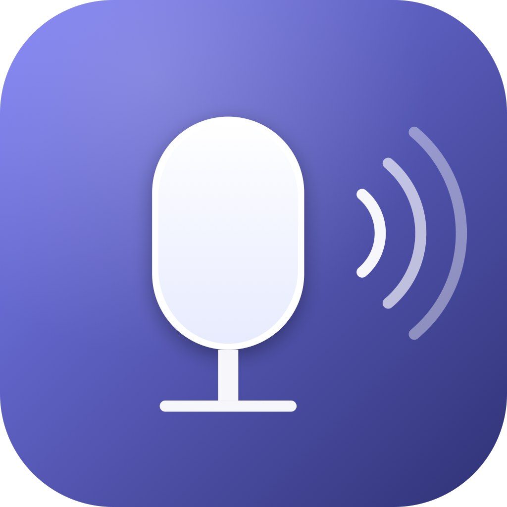

# LocalWhisper

LocalWhisper is a local dictation app inspired by WhisperFlow. Hold a hotkey, speak, release — Whisper Large V3 Turbo transcribes everything offline and the text lands in the active app.



## Platforms

This repository contains two implementations of the same product:

- **macOS** (default): native Swift / SwiftUI menu bar app, optimized for Apple Silicon (Metal + Accelerate). Sources at the repo root (`Sources/LocalWhisper/`). See the macOS sections below.
- **Windows**: C# / WPF tray app under [`Windows/`](Windows/). Build instructions in [`Windows/README.md`](Windows/README.md). Same product behavior (hold-to-talk, offline transcription, clipboard + auto-paste).

Both ports share the same `whisper.cpp` backend and the same UX: hold-to-talk push-to-talk + an optional secondary "lock-in" hotkey for hands-free continuous recording (auto-stops on ~2 s of silence).

## Highlights

- 100% local. No cloud, no telemetry, no account.
- Apple Silicon native (macOS) or x64/ARM64 .NET (Windows). Statically built `whisper.cpp` with Metal+Accelerate (macOS) / CPU/CUDA/Vulkan (Windows).
- Persistent in-memory model: each dictation completes in ~2–3 s after the first warmup.
- On-demand recording HUD with audio level meter and waveform feedback.
- Configurable hotkey (`fn` by default on macOS, `Left Ctrl` on Windows; supports any modifier or combo).
- Optional **continuous lock-in hotkey**: tap a second combo to keep recording hands-free, auto-stops on silence.
- Microphone device picker with a 1.5 s test.
- Tabbed Settings.

## macOS

### Requirements

- macOS 14 (Sonoma) or newer, Apple Silicon recommended
- Xcode Command Line Tools (`xcode-select --install`)
- Homebrew `cmake` (`brew install cmake`)
- ~5 GB free disk (model + binaries)

### Install (from terminal)

```bash
git clone https://github.com/zeddaedoardo-byte/LocalWhisper.git
cd LocalWhisper
./install.sh
```

The installer:

1. Clones and statically builds `whisper.cpp` (Metal + Accelerate).
2. Downloads Whisper Large V3 Turbo (~1.5 GiB) into `~/Library/Application Support/LocalWhisper/Models/`.
3. Builds the Swift app in release mode.
4. Embeds `whisper-cli` and `whisper-server` inside the bundle's `Contents/Resources/bin/`.
5. Signs the bundle with your Apple Development identity if available, otherwise ad-hoc.
6. Copies `LocalWhisper.app` to `/Applications/`.

First setup takes 5–15 minutes (mostly the model download). Subsequent runs are seconds.

## First launch

```bash
open /Applications/LocalWhisper.app
```

The app lives in the menu bar (no Dock icon). On first launch macOS asks for two permissions:

- **Microphone** — to record the audio.
- **Accessibility** — to capture the global hotkey and to auto-paste the transcript.

Default hotkey is hold-`fn`. Change it from Settings → Hotkey.

If macOS Gatekeeper blocks the first launch ("app from unidentified developer"), right-click the app in `/Applications`, choose **Open**, and confirm. This is a one-time prompt.

## Daily use

1. Tieni `fn` (o l'hotkey che hai scelto).
2. Parla.
3. Rilascia — il trascritto compare nel HUD e si incolla nell'app attiva (o resta in clipboard).

The HUD only appears during recording, transcription, and the brief "done" preview. Idle = no overlay.

## Update

```bash
cd LocalWhisper
git pull
./install.sh
```

## Distributing a notarized DMG (developers with Apple Developer Program)

If you want to share the DMG with non-technical users (no Gatekeeper warning,
no terminal) you need an Apple Developer Program membership ($99 / year):

1. Create a **Developer ID Application** certificate at
   <https://developer.apple.com/account/resources/certificates> and install
   it in your login keychain.
2. Generate an app-specific password at <https://appleid.apple.com>.
3. Cache notarytool credentials once:
   ```bash
   xcrun notarytool store-credentials lwf-notary \
     --apple-id "<your-apple-id>" \
     --team-id "<your-team-id>" \
     --password "<app-specific-password>"
   ```
4. Build with hardened runtime + entitlements (auto-detected when the
   Developer ID cert is in the keychain), then notarize:
   ```bash
   ./script/build_release.sh
   ./script/notarize.sh
   ```
5. Ship `dist/release/LocalWhisper-<version>.dmg`. End users drag-install
   without any "unidentified developer" prompt.

## Development workflow

For dev builds without /Applications:

```bash
./script/build_and_run.sh
```

Swift tests:

```bash
swift test --scratch-path /private/tmp/local-whisperflow-swiftpm-build
```

Regenerate the icon:

```bash
./script/make_icon.sh
```

## How it works

- Press the hotkey → AVAudioEngine is already pre-warmed → recording starts in <200 ms.
- Audio captured as PCM 16 kHz mono WAV via AVAudioConverter into a temp file.
- Release the hotkey → multipart POST to `127.0.0.1:18642/inference` (the `whisper-server` child process keeps the model resident).
- Server returns text → app copies to clipboard → optionally pastes via synthetic Cmd-V.

## Windows

The Windows port lives under [`Windows/`](Windows/) and is a standalone .NET 8 / WPF tray app. It mirrors the macOS feature set (hold-to-talk + continuous lock-in) but uses WASAPI for capture and Win32 low-level keyboard hooks for the global hotkey.

### Quick build

```powershell
cd Windows
.\scripts\build_whisper_cpp.ps1   # builds whisper.cpp + downloads the model
.\scripts\build_windows.ps1       # builds the WPF app
```

Full setup, GPU acceleration options (CUDA / Vulkan / OpenVINO), and packaging notes are in [`Windows/README.md`](Windows/README.md).

### Requirements (Windows)

- Windows 10 19041 or newer, Windows 11 recommended
- .NET 8 SDK
- Visual Studio 2022 Build Tools with the C++ desktop workload
- Git, CMake

## Credits

- [whisper.cpp](https://github.com/ggerganov/whisper.cpp) by Georgi Gerganov.
- Whisper model by OpenAI.

## License

MIT (see `LICENSE` if present, otherwise treat as MIT.)
